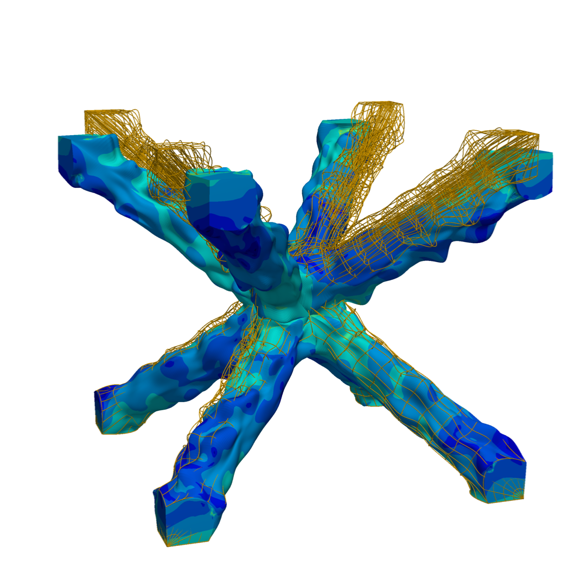

# image2iga: IGA-DigitalTwin-Pipeline

<p align="center">
  
</p>

An integrated ecosystem for creating **Analysis-Ready Digital Twins** from volumetric images (CT-scans). This repository serves as the central hub and orchestrator for a pipeline bridging Computer-Aided Design (CAD), Virtual Image Correlation (VIC), and IsoGeometric Analysis (IGA).


## 🏗 Modular Architecture

The framework consists of three independent libraries. This repository contains the integration example, but the core libraries must be installed separately:

* **[`bsplyne`]([https://github.com/Dorian210/bsplyne](https://github.com/Dorian210/bsplyne))**: The geometric core. Handles multivariate tensor-product B-splines and multi-patch topology.  
    📖 [Documentation](https://dorian210.github.io/bsplyne/) | 📂 [Examples](https://github.com/Dorian210/bsplyne/tree/main/examples)
* **[`IGA_for_bsplyne`]([https://github.com/Dorian210/IGA_for_bsplyne](https://github.com/Dorian210/IGA_for_bsplyne))**: The mechanical solver. A high-performance IGA linear elasticity engine.  
    📖 [Documentation](https://dorian210.github.io/IGA_for_bsplyne/) | 📂 [Examples](https://github.com/Dorian210/IGA_for_bsplyne/tree/main/examples)
* **[`volVIC`]([https://github.com/Dorian210/volVIC](https://github.com/Dorian210/volVIC))**: The vision layer. Performs Virtual Image Correlation to fit B-spline surfaces onto 3D image features.  
    📖 [Documentation](https://dorian210.github.io/volVIC/) | 📂 [Examples](https://github.com/Dorian210/volVIC/tree/main/examples)

> **Note:** Both `bsplyne` and `IGA_for_bsplyne` include a dedicated `examples/tutorial` folder containing a pedagogical PDF guide and ordered Python scripts (`01_...`, `02_...`) for a smooth onboarding.

## 🛠 Installation

We recommend using **Conda** to manage optional but highly recommended high-performance dependencies (like `SuiteSparse`).

### 1. Environment Setup
```bash
conda create -n iga_pipeline python=3.9
conda activate iga_pipeline
```

### 2. Install Optional Dependencies
```bash
conda install scikit-sparse  # Highly recommended for large problems
pip install sparseqr         # Recommended for fast C1 constraint imposition
```

### 3. Install the Libraries
To ensure a consistent environment, it is **recommended** to install the exact versions from the `requirements.txt` file:

```bash
pip install -r requirements.txt
```

Alternatively, since `volVIC` depends on both `bsplyne` and `IGA_for_bsplyne`, you can install the full stack (potentially with more recent versions) via `volVIC`:

```bash
pip install volVIC
```

## 📖 Key Features

* **Unified B-spline Representation**: Continuous pipeline from image registration to simulation without remeshing.
* **High Performance**: Critical numerical kernels are either JIT-compiled with **`numba`** or fully vectorized with **`numpy`** and sparse with **`scipy.sparse`**.
* **Advanced BCs**: Complex kinematic constraints handled via a QR-based condensation layer.

## 🧪 Illustrative Example: BCC Lattice Cell

This repository provides a complete demonstration of an *as-manufactured* digital twin reconstruction. The scripts are located in `examples/geo_to_twin_one_cell/`:

1.  **`make_geo.py`**: Generation of the *as-designed* 48-patch BCC B-spline assembly.
2.  **`fit_tomography.py`**: Rigid ICP pre-alignment and `volVIC` non-rigid surface fitting onto the `cropped_CT_scan.tiff`.
3.  **`compute_response.py`**: Linear elastic IGA simulation (compression-torsion) on the deformed geometry.

## 🎓 Citation & Authors

**Authors:** D. Bichet, J.C. Passieux, J.N. Périé, R. Bouclier

If you use this framework in your research, please cite:

* **The method:**
```bibtex
@article{Bichet2025_method,
  title={Isogeometric multipatch surface fitting in tomographic images: Application to lattice structures},
  author={Bichet, D. and Passieux, J.C. and Périé, J.N. and Bouclier, R.},
  journal={Computer Methods in Applied Mechanics and Engineering},
  volume={436},
  pages={117729},
  year={2025},
  issn={0045-7825},
  doi={10.1016/j.cma.2025.117729},
  url={[https://doi.org/10.1016/j.cma.2025.117729](https://doi.org/10.1016/j.cma.2025.117729)}
}
```
* **The software:**
```bibtex
@article{Bichet2026_software,
  title={image2iga: A JIT-Compiled Python Framework for Image-to-Isogeometric Analysis via Spline Template Fitting},
  author={Bichet, Dorian and Passieux, J-C. and Périé, J-N. and Bouclier, R.},
  year={2026},
  journal={Submitted}
}
```

## 📄 License

This software is governed by the **CeCILL v2.1** license under French law and abiding by the rules of distribution of free software. You can use, modify and/or redistribute the software under the terms of the CeCILL license as circulated by CEA, CNRS and INRIA at the following URL: [http://www.cecill.info](http://www.cecill.info).